<p align="center"></a>
<h1 align="center">cellulite</h1>

[](LICENSE-MIT)
[](https://crates.io/crates/cellulite)
[](https://docs.rs/cellulite)
[](https://deps.rs/repo/github/meilisearch/cellulite)

Cellulite is a crate based on LMDB for storing and retrieving shapes in the geojson format.

The entry point of the crate is the [`Cellulite`] structure which contains all the LMDB database required.
The preferred way of initializing it is through the [`Cellulite::create_from_env`] static method.
```rust,no_run
use cellulite::Cellulite;

let env = unsafe {
    heed::EnvOpenOptions::new()
        .map_size(200 * 1024 * 1024 * 1024)
        .max_dbs(Cellulite::nb_dbs())
        .open("path/to/your/database")
}
.unwrap();
let mut wtxn = env.write_txn().unwrap();
let cellulite = Cellulite::create_from_env(&env, &mut wtxn, "cellulite").unwrap();
```

## Adding or removing shapes

Once the databases are initialized, the only two actions possible with the database are
- Inserting geojson documents
- Removing documents

```rust,no_run
# let (cellulite, env): (cellulite::Cellulite, heed::Env) = todo!();
use geojson::GeoJson;

// We'll need a write transaction in order to write in the database
let mut wtxn = env.write_txn().unwrap();

// First let's add a document:
let geojson_str = r#"
{
  "type": "Feature",
  "properties": { "food": "donuts" },
  "geometry": {
    "type": "Point",
    "coordinates": [ -118.2836, 34.0956 ]
  }
}
"#;

let geojson: GeoJson = geojson_str.parse::<GeoJson>().unwrap();

// The parameters are:
// 1. The write transaction: to be able to write in the databases
// 2. The ID of the document is a `u32`. If a document already exists with the
//    same ID, it'll be removed and replaced by the new one
// 3. The geojson we want to insert
cellulite.add(&mut wtxn, 0, &geojson).unwrap();

// The parameters are:
// 1. The write transaction: to be able to write in the databases
// 2. The ID of the document to remove
cellulite.delete(&mut wtxn, 35).unwrap();

// Finally, we must build our database with all the changes we applied.
// The parameters are:
// 1. The write transaction: to be able to write in the databases
// 2. A closure that can return `true` if we need to cancel the build asap
// 3. Anything that implements the [`steppe::Progress`] trait to follow the progress of the build
cellulite.build(&mut wtxn, &|| false, &steppe::NoProgress);
```

## Retrieving the items

When we insert documents into the databases, they're not saved as-is and thus cannot be returned.
This means, if you need to get back the original geojson it's your job to save it somewhere,
the methods we're going to see in this part are only returning the IDs of the matching documents:

```rust,no_run
# let (cellulite, env): (cellulite::Cellulite, heed::Env) = todo!();
use geo::{polygon, point};

// We only need a read transaction to search in the database
let mut rtxn = env.read_txn().unwrap();

// The main way of searching for documents is through the `in_shape` method:
// - The first parameter is the read transaction required to read from the database
// - The second parameter is the polygon you want to retrieve the documents in
// Note: Cellulite returns both the shapes contained inside the polygon or intersecting with the polygon.
let _doc_ids = cellulite.in_shape(&rtxn, &polygon![
    (x: -111., y: 45.),
    (x: -111., y: 41.),
    (x: -104., y: 41.),
    (x: -104., y: 45.),
]).unwrap();

// The other method available for search is [`Cellulite::in_circle`], which doesn't search in a perfect
// circle though, it searches in a polygon, doing an approximation of a circle.
// - The first parameter is the read transaction required to read from the database
// - The second parameter is the center of the circle you want to search in
// - The third parameter is its radius
// - The fourth parameter is the resolution of the polygon to circle approximation. It represents the
//   number of points that should compose the polygon. More points mean a more precise and slower search.
let _doc_ids = cellulite.in_circle(&rtxn, point! { x: 181.2, y: 51.79 }, 1000.0, 15).unwrap();
```

## Performances

One big subject that always comes back is;

> Ok, that's cool, but what about the performances???

So, I just ran some indexing processes on my personal MacBook Pro 2021 - M1 Max.
It's using the original SSD NVMe of the Mac, and the Mac is plugged in.

| Dataset                                                                           | Time to index | Time to search inside a single parcel (about 10m^2) | Time to search in a few blocks (2km^2) | Time to search a very large region (80mk^2) |
| --------------------------------------------------------------------------------  | ------------- | --------------------------------------------------- | -------------------------------------- | ------------------------------------------- |
| Indexing **3\_699\_966** parcels of the densest part of France around Paris.      | 6m 25s        | 1.13ms for 1 match                                  | 6.46ms for 2_633 matches               | 39ms for 77_482 matches                     |
| Indexing **952\_254** parcels around Lyon, a large city in France                 | 1m 41s        | 700us for 1 match                                   | 2.61ms for 514 matches                 | 51ms for 39_518 matches                     |
| Indexing **594\_362** parcels in Lozère, a practically empty department of France | 1m 03s        | 836us for 1 match                                   | 2.82ms for 273 matches                 | 23.32ms for 4_565 matches                   |

## Internals for contributors and maintainers

This part is dedicated to explaining the internal tools, algorithms and the few LMDB tricks we use.

### Toolings

TODO TODO
- To index stuff
- To display stuff
TODO TODO

### How is the data stored

Cellulite is a big inverted index that partitions its search space thanks to [H3 geospatial cell indexes](https://h3geo.org/).
In the rest of this text, every time we refer to a "cell" we're actually talking about an h3 cell index. That's also where
the name "cellulite" comes from.
A cell is:
- Represented in memory as a 64-bit number
- The cells close to each other geographically also share numbers close to each other
- The geographic zone represented by the cells are hexagons or pentagons
- They also contain a resolution between 0 and 15 that controls the size of the hexagon.

The general idea is to represent the shapes (geojson) we store in terms of h3 cells:

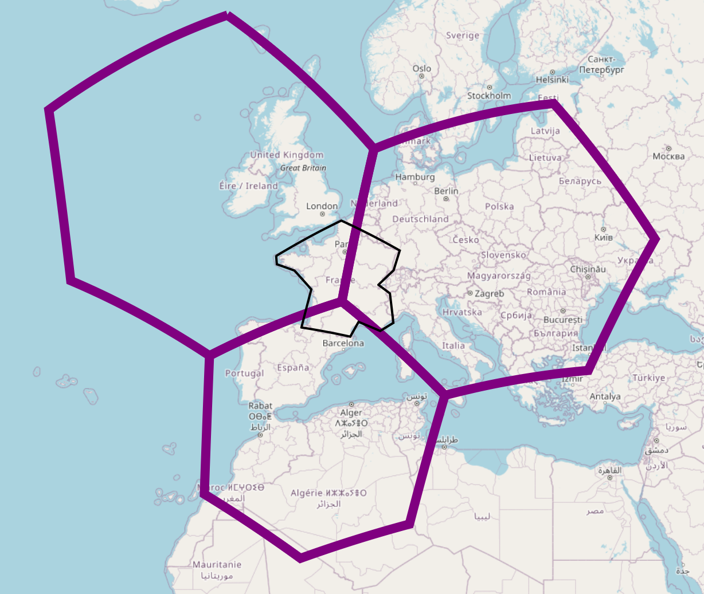

Once a cell is "full" (in our example, this happens when there are two shapes or more in a single cell),
we store the shapes at an increased resolution.

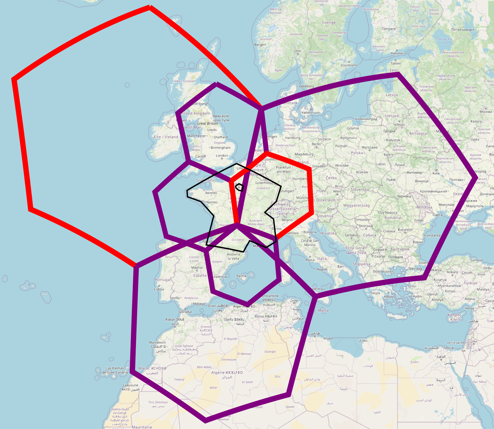

In the previous picture, we see that a hexagon is still red, that's because it's the only one containing two
shapes, let's zoom again:

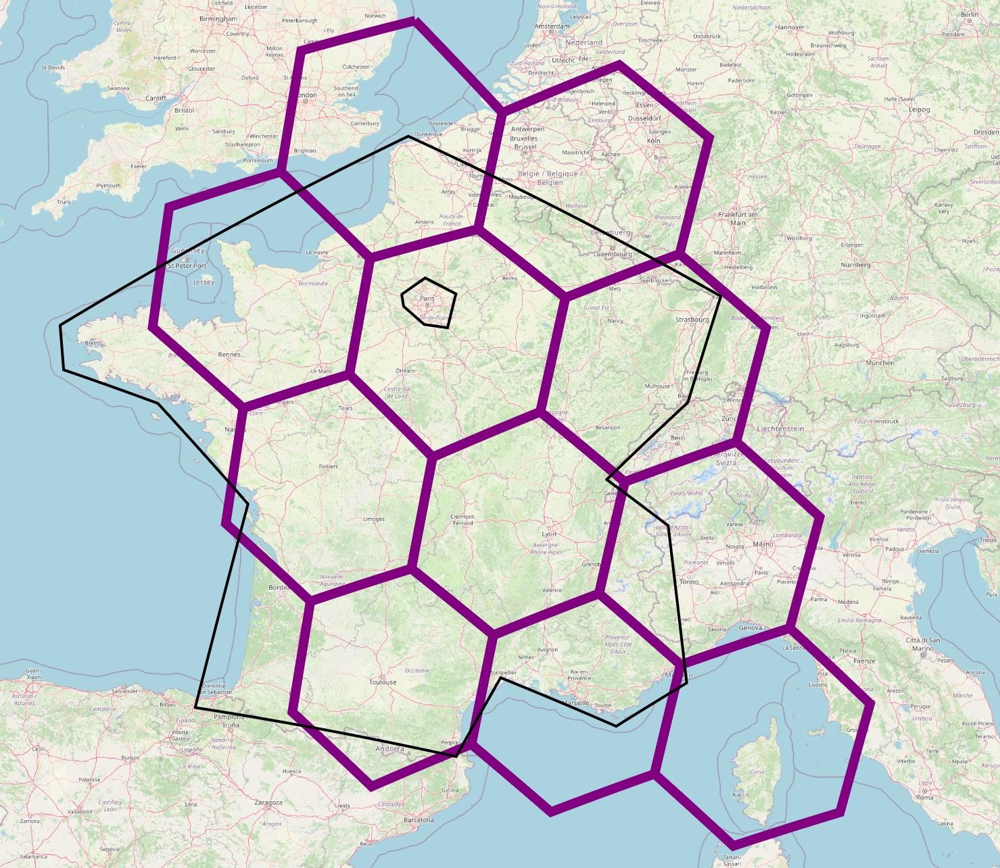

That's all the cells we need to store to represent the large shape + the small one.

> ok, but why the cell containing Paris is not red again?

And that's the last concept we need to understand to grasp the full indexing process:
Every time a cell is **entirely contained**  inside of a shape, instead of increasing the resolution
again we store this cell as a "belly cell" at this resolution forever.

> How do we know if a cell is full

Currently, this part has not been explored very much.
It's a constant set to 200.
The general idea is that we're looking for the point where retrieving and computing
the relation between all the items contained in a cell takes less time than diving
up in the resolution, comparing the relation between the shape and multiple cells, and
in the end, still comparing the query shape to a lot of the shapes that are effectively
close to the "edge" of the query shape.
If we want to change this number, we should heavily benchmark and take multiple things into account:
- The speed of the disk will have a huuuuge impact on that. If retrieving a cell takes
  less than 1ms, like on an SSD, the thresholds will be way smaller than if your disk is
  an EBS with 25ms of latency. We're basically exchanging IO time for CPU time,
  so knowing the kind of IO we're dealing with is very important.
- The available RAM, cellulite relies heavily on memory mapping, so the more RAM you have, and
  the less you'll need to retrieve data from the disk.
- The kind of workload: computing the relation between two polygons takes way more time than
  computing the relation between a polygon and a point. So, if your benchmarks input data only contains points,
  you'll end up with a threshold way larger than what you would have gotten with polygons.

### Indexing

To organize the data like that, we have to go through a bunch of steps:
1. When users insert items, we store them in LMDB but don't do anything.
2. Later on, the user will call the build method in order to trigger the indexing process
3. Build starts by retrieving all the items
4. First, we create inverted indexes mapping cells (and belly cell) to shape, but only at the resolution 0
5. Then, for each resolution 0 cells that are too large, we dive into the children of the cell:
  - If it was already too large, we call ourselves at resolution+1 for all the items we're inserting
  - If it was not too large, we have to retrieve all the items in the current cell (even the ones we didn't insert in this build process)
    and insert them in the children of the current cell, and call ourselves for all the cells that are too large.
6. Repeat step 5 for all the cells that are too large

Let's see together what the insertion of 3.6+M cadastre parcel looks like in one of the densest regions of the world: Île de France.

1. After calling `build`, all the shapes are inserted at res0. Everything falls on only two cells. They are red because they're completely full.

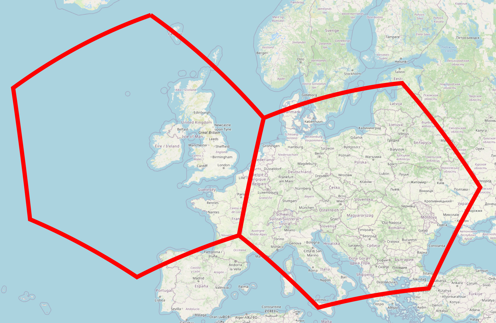

2. Then we iterate over all the "full" cells and split and partition them in their children.

| Resolution |  Image                                      | Remark                                                                        |
| ---------- | ------------------------------------------- | ----------------------------------------------------------------------------- |
| 1          | 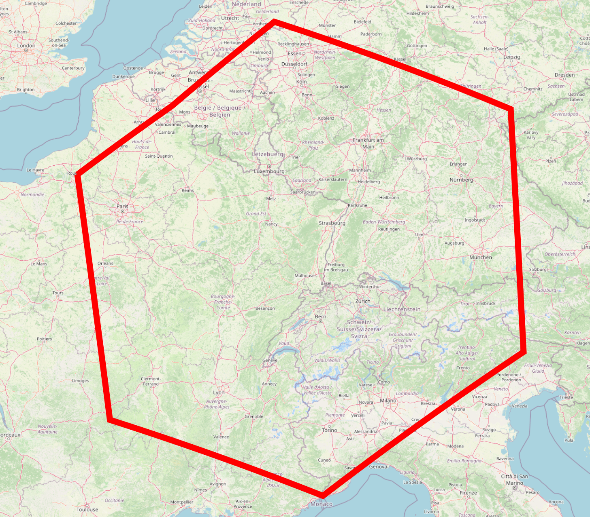  | Even though we had two cells initially, we ended up with only one at the res1 |
| 2          |   | Pretty much the same, let's skip an iteration                                 |
| 4          | 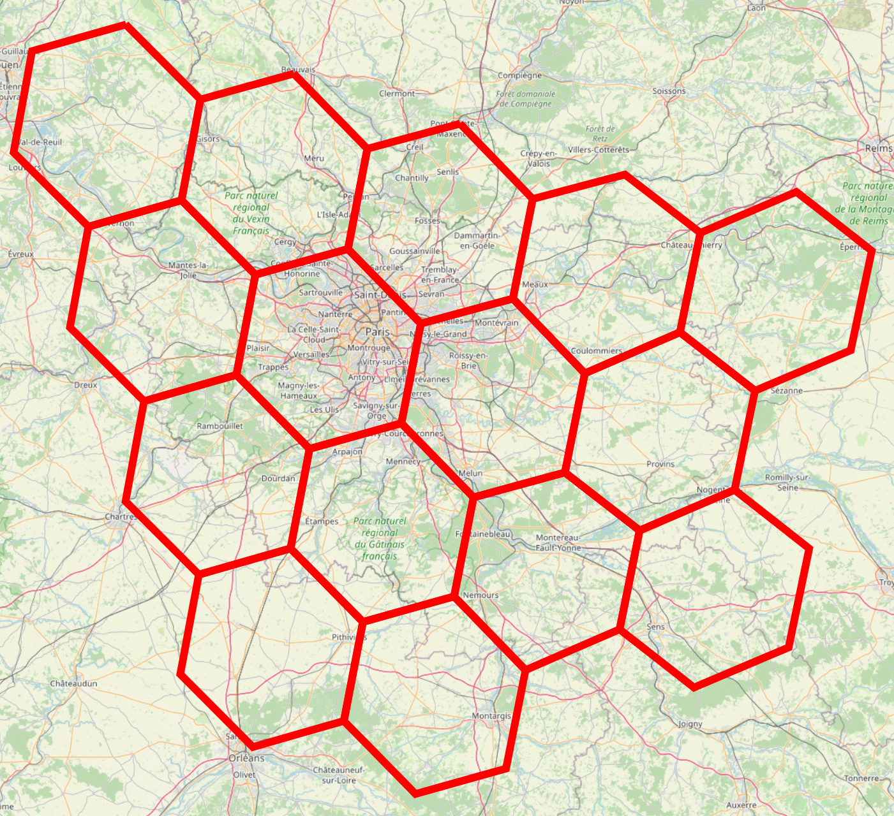  | We're starting to see the shape of everything we've indexed appear            |
| 7          | 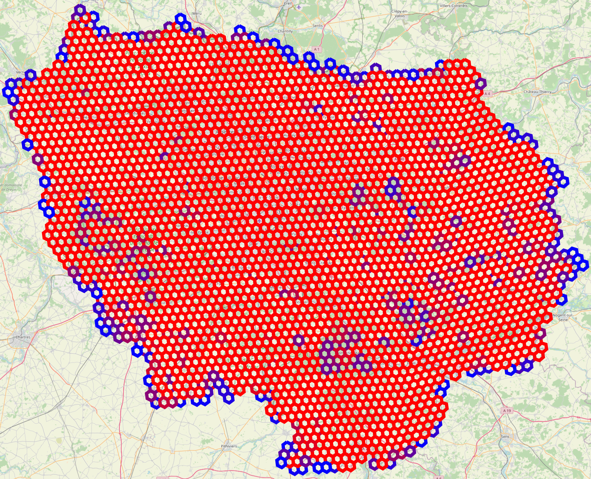  | Although most cells are still full (red), we're starting to see a lot of blue cells on the edges. Which means we're approaching the maximum resolution we'll reach |
| 9          | 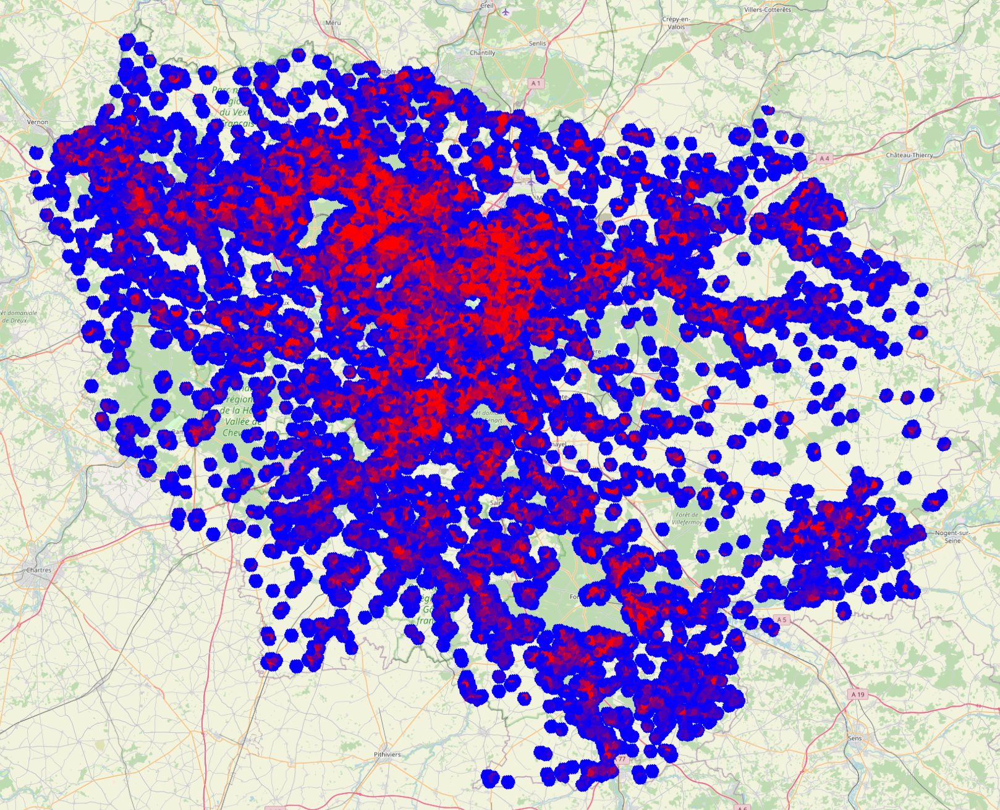  | And finally, we can clearly see how the densest area of IdF still contains cells, while the majority of the department doesn't need to go any deeper |

In the end we had to create 133\_849 cells to holds the 3\_699\_966 documents.

### Query

Now we've seen how the data is laid out on disk, let's see how we can make a query against it.

Internally, cellulite only allow one kind of query: Query that returns all the items contained, containing or intersecting with a specified polygon.

And the algorithm goes as-is:
1. Convert the query polygon to the cell we have to explore
2. For all the cells we see:
  1. Check if there is a corresponding belly cell in the DB. This guarantees we're
    either intersecting or fully contained within a shape. We add all the IDs contained
    in this belly cell to the matching items 
  2. If there is a normal cell, we have multiple cases:
    - The cell is entirely contained within our shape: We add its content to the items to return. No need to check what it contains it's guaranteed to be valid.
    - The cell is not contained in our shape: We ignore it
    - The cell doesn't exist in the database: We ignore it
    - The cell intersects with our shape; two more cases are possible:
      - The cell is full: We start back at step 2 with all its children
      - The cell is not full: We add the items it contains to a list of items to double-check
3. Then, we remove all the "validated" items that are guaranteed to be right from the list of items to double-check. There may be many duplicates.
4. And finally, we retrieve and compare one by one all the items that are in the list of items to double-check

As for the indexing process, let's see step by step how a query goes:

| Resolution |  Image                                      | Remark                                                                        |
| ---------- | ------------------------------------------- | ----------------------------------------------------------------------------- |
| 0          | 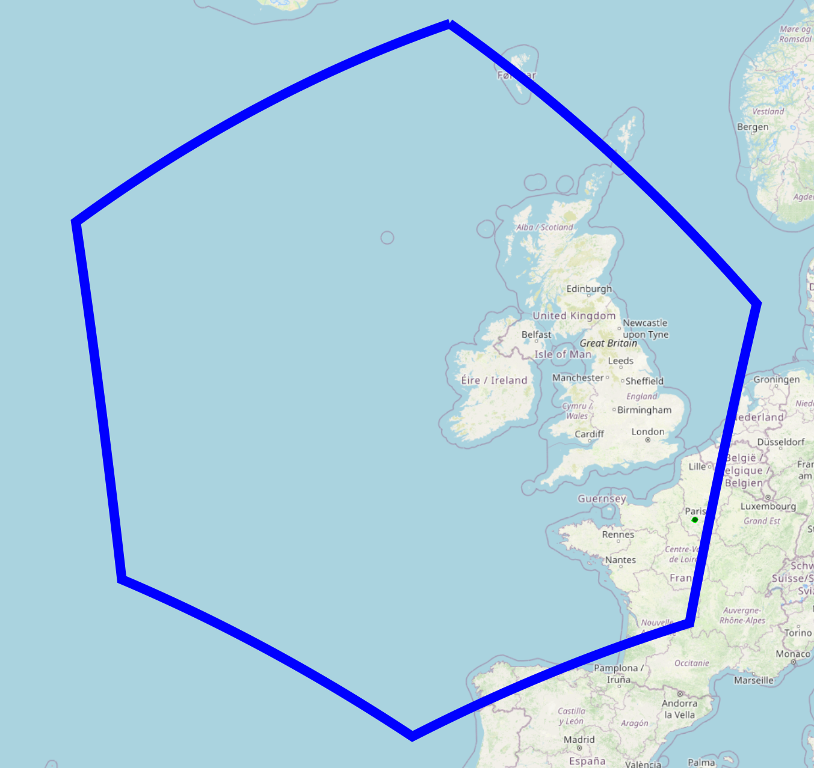     | At res 0, as you would expect we're simply retrieving all the cells covering our polygon |
| 1          | 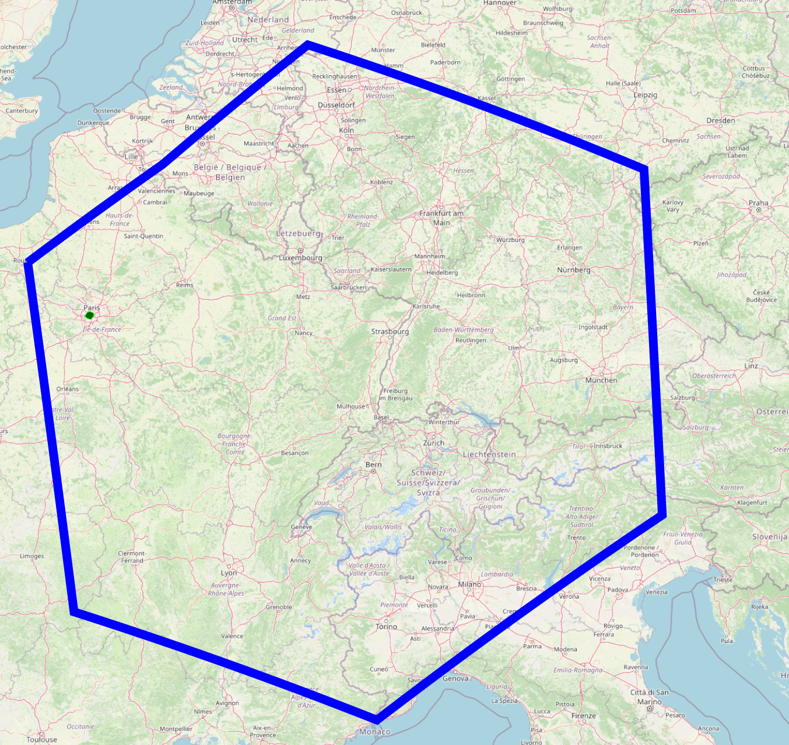     | At res 1, though, you should notice I lied to you above. Instead of retrieving all the children of the current cell, we prefer to cover our shape at res+1 when the cells are way larger than our shape |
| 7          | 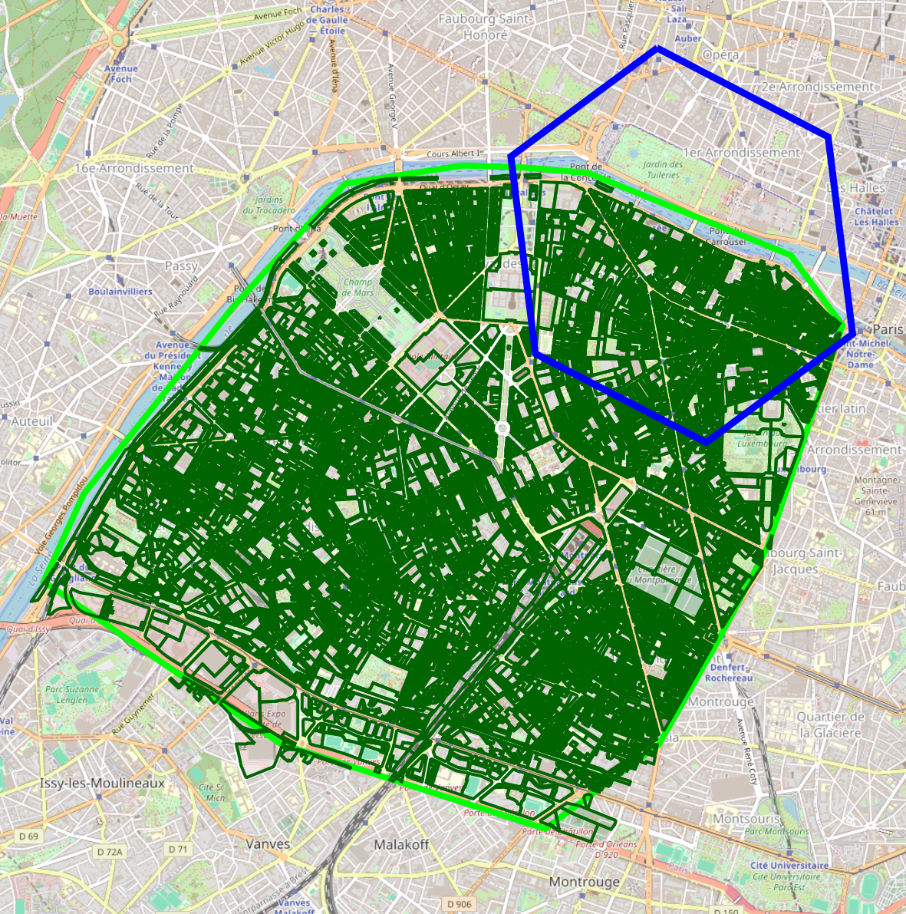     | This goes on till res 7, where our cell is still too large in comparison to our shape |
| 8          | 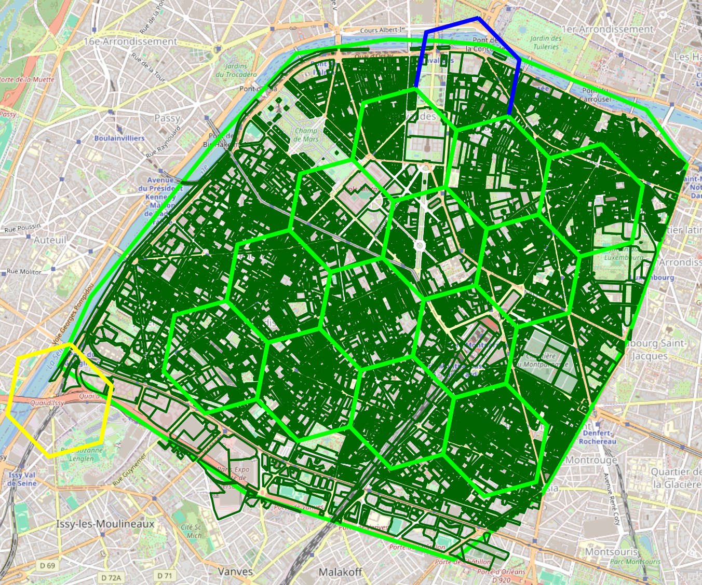     | At res 8 we're starting to validate a lot of cells that entirely fits within our shape. But we still need to dive in for the edges. The yellow cell means we cannot increase the resolution there and will have to double-check all the items it contains at the end |
| 9          | 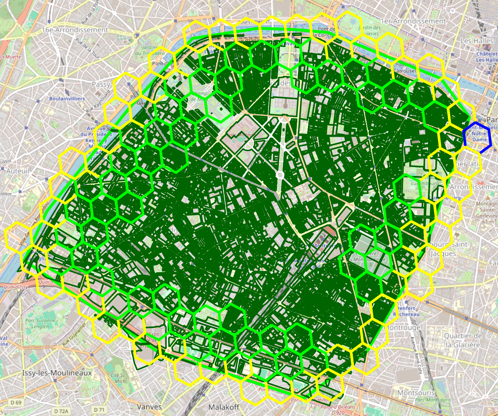     | At res 9 it's the same except there is way more yellow cells to double-check. If you remember the cells we stored in the database earlier, that makes sense since we're close to the maximum resolution we stored there. Only one blue cell remains, let's increase the resolution one last time |
| 10         | 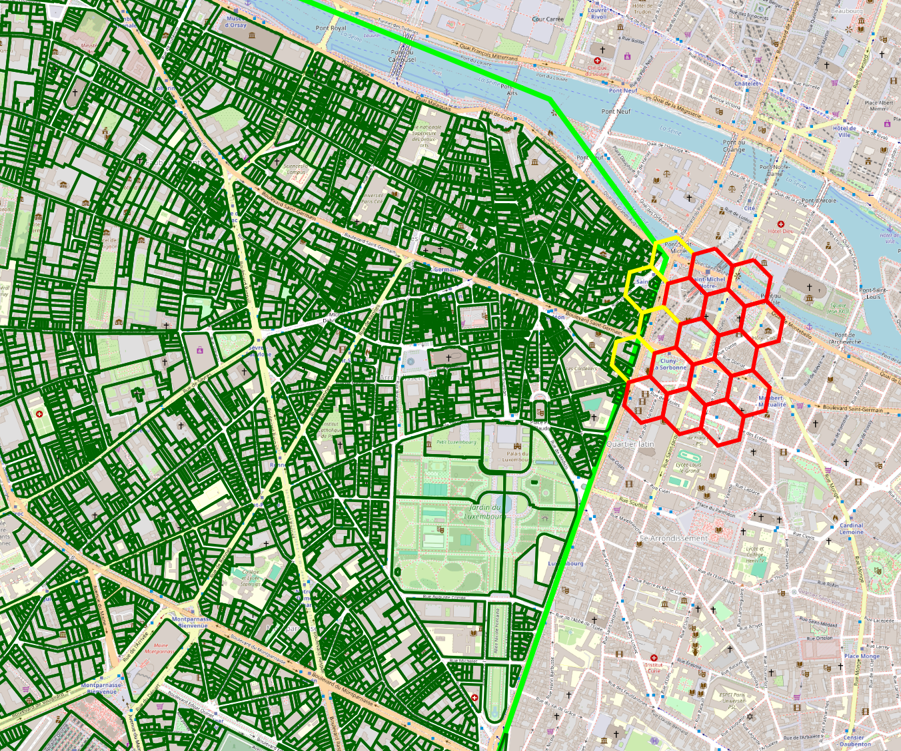    | On this last step, you can clearly see we didn't cheat and try to cover the whole shape at this res, this would generate approximately 1129 new cells to look up in the database. Instead, we only looked at the 17 children of the blue cell. The red ones were not part of our shape and have been ignored |

This query matched 14_322 items and had to look up about 300 cells before starting
to compare the items to double-check against the final shapes. On my computer, it ran in 11ms.

### Tricks

- The normal and belly cells are stored with their keys at the end, this means at
  search time we can retrieve both very quickly with an LMDB iter
- Multiple database to be able to write while we read
