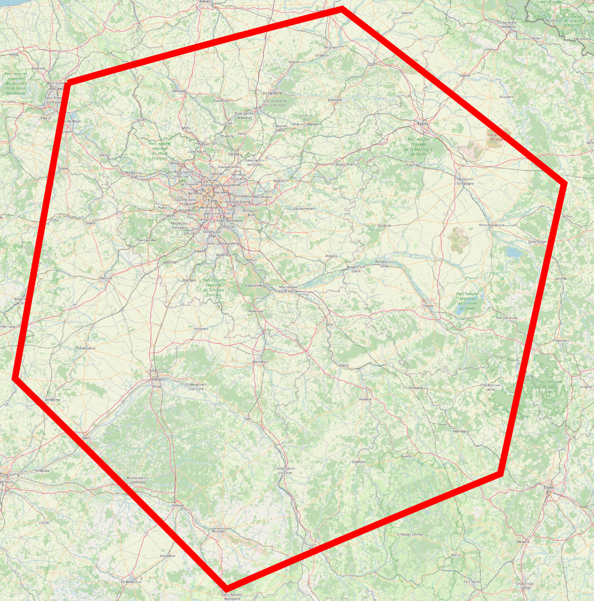

<p align="center"></a>
<h1 align="center">cellulite</h1>

[](LICENSE-MIT)
[](https://crates.io/crates/cellulite)
[](https://docs.rs/cellulite)
[](https://deps.rs/repo/github/meilisearch/cellulite)

Cellulite is a crate based on LMDB for storing and retrieving shapes in the geojson format.

The entry point of the crate is the [`Cellulite`] structure which contains all the LMDB database required.
The preferred way of initializing it is through the [`Cellulite::create_from_env`] static method.
```rust,no_run
use cellulite::Cellulite;

let env = unsafe {
    heed::EnvOpenOptions::new()
        .map_size(200 * 1024 * 1024 * 1024)
        .max_dbs(Cellulite::nb_dbs())
        .open("path/to/your/database")
}
.unwrap();
let mut wtxn = env.write_txn().unwrap();
let cellulite = Cellulite::create_from_env(&env, &mut wtxn, "cellulite").unwrap();
```

## Adding or removing shapes

Once the databases are initialized, the only two actions possible with the database are
- Inserting geojson documents
- Removing documents

```rust,no_run
# let (cellulite, env): (cellulite::Cellulite, heed::Env) = todo!();
use geojson::GeoJson;

// We'll need a write transaction in order to write in the database
let mut wtxn = env.write_txn().unwrap();

// First let's add a document:
let geojson_str = r#"
{
  "type": "Feature",
  "properties": { "food": "donuts" },
  "geometry": {
    "type": "Point",
    "coordinates": [ -118.2836, 34.0956 ]
  }
}
"#;

let geojson: GeoJson = geojson_str.parse::<GeoJson>().unwrap();

// The parameters are:
// 1. The write transaction: to be able to write in the databases
// 2. The ID of the document is a `u32`. If a document already exists with the
//    same ID, it'll be removed and replaced by the new one
// 3. The geojson we want to insert
cellulite.add(&mut wtxn, 0, &geojson).unwrap();

// The parameters are:
// 1. The write transaction: to be able to write in the databases
// 2. The ID of the document to remove
cellulite.delete(&mut wtxn, 35).unwrap();

// Finally, we must build our database with all the changes we applied.
// The parameters are:
// 1. The write transaction: to be able to write in the databases
// 2. A closure that can return `true` if we need to cancel the build asap
// 3. Anything that implements the [`steppe::Progress`] trait to follow the progress of the build
cellulite.build(&mut wtxn, &|| false, &steppe::NoProgress);
```

## Retrieving the items

When we insert documents into the databases, they're not saved as-is and thus cannot be returned.
This means, if you need to get back the original geojson it's your job to save it somewhere,
the methods we're going to see in this part are only returning the IDs of the matching documents:

```rust,no_run
# let (cellulite, env): (cellulite::Cellulite, heed::Env) = todo!();
use geo::{polygon, point};

// We only need a read transaction to search in the database
let mut rtxn = env.read_txn().unwrap();

// The main way of searching for documents is through the `in_shape` method:
// - The first parameter is the read transaction required to read from the database
// - The second parameter is the polygon you want to retrieve the documents in
// Note: Cellulite returns both the shapes contained inside the polygon or intersecting with the polygon.
let _doc_ids = cellulite.in_shape(&rtxn, &polygon![
    (x: -111., y: 45.),
    (x: -111., y: 41.),
    (x: -104., y: 41.),
    (x: -104., y: 45.),
]).unwrap();

// The other method available for search is [`Cellulite::in_circle`], which doesn't search in a perfect
// circle though, it searches in a polygon, doing an approximation of a circle.
// - The first parameter is the read transaction required to read from the database
// - The second parameter is the center of the circle you want to search in
// - The third parameter is its radius
// - The fourth parameter is the resolution of the polygon to circle approximation. It represents the
//   number of points that should compose the polygon. More points mean a more precise and slower search.
let _doc_ids = cellulite.in_circle(&rtxn, point! { x: 181.2, y: 51.79 }, 1000.0, 15).unwrap();
```

## Performances

One big subject that always comes back is;

> Ok, that's cool, but what about the performances???

So, I just ran some indexing processes on my personal MacBook Pro 2021 - M1 Max.
It's using the original SSD NVMe of the Mac, and the Mac is plugged in.

| Dataset                                                                           | Time to index | Time to search inside a single parcel (about 10m^2) | Time to search in a few blocks (2km^2) | Time to search a very large region (80mk^2) |
| --------------------------------------------------------------------------------  | ------------- | --------------------------------------------------- | -------------------------------------- | ------------------------------------------- |
| Indexing **3\_699\_966** parcels of the densest part of France around Paris.      | 6m 25s        | 1.13ms for 1 match                                  | 6.46ms for 2_633 matches               | 39ms for 77_482 matches                     |
| Indexing **952\_254** parcels around Lyon, a large city in France                 | 1m 41s        | 700us for 1 match                                   | 2.61ms for 514 matches                 | 51ms for 39_518 matches                     |
| Indexing **594\_362** parcels in Lozère, a practically empty department of France | 1m 03s        | 836us for 1 match                                   | 2.82ms for 273 matches                 | 23.32ms for 4_565 matches                   |

## Internals for contributors and maintainers

This part is dedicated to explaining the internal tools, algorithms and the few LMDB tricks we use.

### Cloning this repository

I pushed the dataset used in my benchmarks under Git LFS references stored in the `assets` directory.
So if you don't plan on running the benchmarks, you can skip their download by adding
`GIT_LFS_SKIP_SMUDGE=1` to your cloning command:
```bash
# with gh
GIT_LFS_SKIP_SMUDGE=1 gh repo clone meilisearch/cellulite

# with git
GIT_LFS_SKIP_SMUDGE=1 git clone https://github.com/meilisearch/cellulite
```

FYI, there are about 12GiB of datasets in the repo.

### Toolings

#### Indexing stuff and benchmarking

I made a crate that I use both to index data in a database I'll explore later, or
to benchmark the search query/profile.
It's the `benchmark` crate, the `--help` is pretty self-explanatory:

```text
Usage: benchmarks [OPTIONS]

Options:
  -d, --dataset <DATASET>
          Name of the dataset to use

          [default: shop]

          Possible values:
          - shop:              100_000 points representing shops in France
          - paris-voies:       25_038 lines representing road section in Paris
          - cadastre-addr:     22_000_000 points representing houses and buildings in France
          - cadastre-parcelle: With the selector you can chose a department in france with its number
          - canton
          - arrondissement
          - commune
          - departement
          - region:            13 regions in France
          - zone:              Mix of all the canton, arrondissement, commune, departement and region

      --selector <SELECTOR>
          Selector to use for the dataset, will do something different for each dataset

      --no-indexing
          Skip indexing altogether and only benchmark the search requests. You must provide the path to a database

      --no-insert
          Skip inserting the items, can be useful if you already inserted the items with skip_build and only want to benchmark the build process

      --no-build
          Don't build the index after inserting the items

      --no-commit
          Don't commit after the operation, can be useful to benchmark only the build part of the indexing process without having to make the insertion again

      --no-queries
          Skip query if set

      --index-metadata
          Index metadata if set. Only valid if skip_indexing is false. This will create a new database for the metadata which will significantly slow down the indexing process. It should not be set when doing actual benchmarks. It also consume a lot of memory as we must stores all the strings of the whole dataset in memory

      --limit <LIMIT>
          Set the number of items to index, will be capped at the number of items in the dataset

      --db <DB>
          Db path, if not provided, a temporary directory will be used and freed at the end of the benchmark

  -h, --help
          Print help (see a summary with '-h')
```

The command I use the most is this one:
```
cargo run -p benchmarks --release -- --dataset cadastre-parcelle --no-queries --db lyon.mdb --selector 69
```

It takes the datasets containing all the parcels of the French cadastre, and don't run the query benchmarks,
set the DB path to `lyon.mdb` and finally select the `69` department of France, which contains the city of Lyon.

This will display a live report of the indexing process:
```text
Starting...
Deserialized the points in 94.208µs
Database setup
Inserting points
Importing assets/cadastre_parcelle/69.json.gz
Inserted 255531 additional points in 1.00s, throughput: 255530.45 points / seconds || In total: 770163 points, started 20.82s ago, throughput: 36989.68 points / seconds
Inserted 952254 points in 21.53s. Throughput: 44234.79 points / seconds
Building the index...
{
{
  "steps": [],
  "percentage": 0.0,
  "duration": "1m 42s 16ms 984µs"
}
retrieve updated items > item => total: 166ms 142µs (0.16%) self: 166ms 142µs (0.16%)
retrieve updated items => total: 166ms 142µs (0.16%) self: 0s (0.00%)
clear updated items => total: 25µs (0.00%) self: 25µs (0.00%)
remove deleted items from database > remove deleted items from items database > item => total: 14µs (0.00%) self: 14µs (0.00%)
remove deleted items from database > remove deleted items from items database => total: 15µs (0.00%) self: 1µs (0.00%)
remove deleted items from database > remove deleted items from cells database > cell => total: 159ms 84µs (0.16%) self: 159ms 84µs (0.16%)
remove deleted items from database > remove deleted items from cells database => total: 159ms 125µs (0.16%) self: 41µs (0.00%)
remove deleted items from database => total: 159ms 146µs (0.16%) self: 21µs (0.00%)
insert items at level zero > split items to cells > item => total: 2s 965ms 816µs (2.91%) self: 2s 965ms 816µs (2.91%)
insert items at level zero > split items to cells => total: 2s 965ms 816µs (2.91%) self: 0s (0.00%)
insert items at level zero > merge cells map => total: 185µs (0.00%) self: 185µs (0.00%)
insert items at level zero > write cells to database > cell => total: 79µs (0.00%) self: 79µs (0.00%)
insert items at level zero > write cells to database => total: 96µs (0.00%) self: 17µs (0.00%)
insert items at level zero => total: 2s 966ms 164µs (2.91%) self: 2s 966ms 68µs (2.91%)
insert items recursively => total: 1m 38s 593ms 957µs (96.71%) self: 1m 38s 593ms 957µs (96.71%)
update the metadata => total: 59ms 234µs (0.06%) self: 59ms 234µs (0.06%)
Finished in 1m 41s 944ms 703µs
```

#### How to inspect the content of a database

I heavily relied on the `display` crate, which is in the `examples/display` directory, to debug during development.
It has no usage but takes only one optional argument: The database path.
If you don't specify anything, it will create a temporary database that will be removed once the program exits.
If you specify a database path, it opens it.

> [!NOTE]  
> Don't forget this program is mainly made to help you **debug** and understand your code. To help us understand
> what's going on, it's loading the whole database in RAM and won't work with very large databases.

The few things you need to know are located on the UI let's jump on everything that's included:


That's what you'll see after launching the crate. You need access to the network to load the map.
You can scroll or drag the map wherever you want.

But most options are on the right, we'll go through all categories together.

##### Debug


This part is really here to help you debug what's stored in your database. From top to bottom:
- You have the current position of the mouse
- The position of the last **left click**, that's really handy when you're writing a test and need to copy and paste a location
- Then, h3 cells are at the last position, all sorted by their resolution. It's clickable and brings you to the official H3 website
- Then, there is a button to insert 1000 random points into the database. This can be useful when updating the indexing algorithm.
- Another button to display the items in the database, that's probably the single most important button of this whole interface.
  It helps you very quickly see if your filter is missing documents or not
- And the last button is doing the same thing, but with the cells

##### Insert


This part is dedicated to inserting documents into the database.
That's very useful as well when you're trying to debug something or understand
how the cells split themselves.

> [!TIP]
> Most of the time, you'll also want to reduce the threshold in src/lib.rs:95 to something easier to reach, like 3 instead of 200.

There is not much to see here; you can name your shape to inspect it later.
Then you must choose the kind of shape you want to insert; currently, only points, multi-points, and polygons are supported.
Which means we're missing:
- Multi-polygon
- Lines
- Multi-Lines
- Collection

After selecting one of these, you draw it on the map by pressing right-click for each point you want to insert.
Once you're done, you click "complete", and the shape will be inserted.
There is no validation for single points.

##### Filter


Here's the most important category, the one that lets you filter documents!
When you open it, you're just greeted with a "draw polygon" button.
After clicking on the button, you have to draw your shape on the map with right clicks, similar to how you
insert points.
Then you can complete your polygon, and it'll run a query. This can take some time; the display part is
often the slowest.
Once done, you'll end up with something similar to the screenshot above, containing the following information:
1. Some stats about the query you made, the number of points, the surface, and the perimeter
2. The number of matches returned
3. The time to process the query, the cold time, is extracted from the first query, and the hot time is computed after executing the same query three times.
4. The most important part: You can observe and inspect how a query is being executed, use the slider of `+` and `-` to see all the cells we've inspected
  - The **blue** cells represent cells that are full and require us to "deep dive" and call ourselves again at the next resolution
  - The **green** cells are cells entirely contained within the queried shape, all the items they contain are marked as valid and will be returned
  - The **red** cells are cells that exist in the database but are not part of our shape
  - The **black** cells are cells that don't exist in the database
5. The double slider below lets you filter the cells you see by resolution
6. Finally, the coords that make your polygon

### How is the data stored

Cellulite is a big inverted index that partitions its search space thanks to [H3 geospatial cell indexes](https://h3geo.org/).
In the rest of this text, every time we refer to a "cell" we're actually talking about an h3 cell index. That's also where
the name "cellulite" comes from.
A cell is:
- Represented in memory as a 64-bit number
- The cells close to each other geographically also share numbers close to each other
- The geographic zone represented by the cells are hexagons or pentagons
- They also contain a resolution between 0 and 15 that controls the size of the hexagon.

The general idea is to represent the shapes (geojson) we store in terms of h3 cells:


Once a cell is "full" (in our example, this happens when there are two shapes or more in a single cell),
we store the shapes at an increased resolution.


In the previous picture, we see that a hexagon is still red, that's because it's the only one containing two
shapes, let's zoom again:


That's all the cells we need to store to represent the large shape + the small one.

> ok, but why the cell containing Paris is not red again?

And that's the last concept we need to understand to grasp the full indexing process:
Every time a cell is **entirely contained**  inside of a shape, instead of increasing the resolution
again we store this cell as a "belly cell" at this resolution forever.

> How do we know if a cell is full

Currently, this part has not been explored very much.
It's a constant set to 200.
The general idea is that we're looking for the point where retrieving and computing
the relation between all the items contained in a cell takes less time than diving
up in the resolution, comparing the relation between the shape and multiple cells, and
in the end, still comparing the query shape to a lot of the shapes that are effectively
close to the "edge" of the query shape.
If we want to change this number, we should heavily benchmark and take multiple things into account:
- The speed of the disk will have a huuuuge impact on that. If retrieving a cell takes
  less than 1ms, like on an SSD, the thresholds will be way smaller than if your disk is
  an EBS with 25ms of latency. We're basically exchanging IO time for CPU time,
  so knowing the kind of IO we're dealing with is very important.
- The available RAM, cellulite relies heavily on memory mapping, so the more RAM you have, and
  the less you'll need to retrieve data from the disk.
- The kind of workload: computing the relation between two polygons takes way more time than
  computing the relation between a polygon and a point. So, if your benchmarks input data only contains points,
  you'll end up with a threshold way larger than what you would have gotten with polygons.

### Indexing

To organize the data like that, we have to go through a bunch of steps:
1. When users insert items, we store them in LMDB but don't do anything.
2. Later on, the user will call the build method in order to trigger the indexing process
3. Build starts by retrieving all the items
4. First, we create inverted indexes mapping cells (and belly cell) to shape, but only at the resolution 0
5. Then, for each resolution 0 cells that are too large, we dive into the children of the cell:
  - If it was already too large, we call ourselves at resolution+1 for all the items we're inserting
  - If it was not too large, we have to retrieve all the items in the current cell (even the ones we didn't insert in this build process)
    and insert them in the children of the current cell, and call ourselves for all the cells that are too large.
6. Repeat step 5 for all the cells that are too large

Let's see together what the insertion of 3.6+M cadastre parcel looks like in one of the densest regions of the world: Île de France.

1. After calling `build`, all the shapes are inserted at res0. Everything falls on only two cells. They are red because they're completely full.


2. Then we iterate over all the "full" cells and split and partition them in their children.

| Resolution |  Image                                      | Remark                                                                        |
| ---------- | ------------------------------------------- | ----------------------------------------------------------------------------- |
| 1          |   | Even though we had two cells initially, we ended up with only one at the res1 |
| 2          |   | Pretty much the same, let's skip an iteration                                 |
| 4          |   | We're starting to see the shape of everything we've indexed appear            |
| 7          |   | Although most cells are still full (red), we're starting to see a lot of blue cells on the edges. Which means we're approaching the maximum resolution we'll reach |
| 9          |   | And finally, we can clearly see how the densest area of IdF still contains cells, while the majority of the department doesn't need to go any deeper |

In the end we had to create 133\_849 cells to holds the 3\_699\_966 documents.

### Query

Now we've seen how the data is laid out on disk, let's see how we can make a query against it.

Internally, cellulite only allow one kind of query: Query that returns all the items contained, containing or intersecting with a specified polygon.

And the algorithm goes as-is:
1. Convert the query polygon to the cell we have to explore
2. For all the cells we see:
  1. Check if there is a corresponding belly cell in the DB. This guarantees we're
    either intersecting or fully contained within a shape. We add all the IDs contained
    in this belly cell to the matching items 
  2. If there is a normal cell, we have multiple cases:
    - The cell is entirely contained within our shape: We add its content to the items to return. No need to check what it contains it's guaranteed to be valid.
    - The cell is not contained in our shape: We ignore it
    - The cell doesn't exist in the database: We ignore it
    - The cell intersects with our shape; two more cases are possible:
      - The cell is full: We start back at step 2 with all its children
      - The cell is not full: We add the items it contains to a list of items to double-check
3. Then, we remove all the "validated" items that are guaranteed to be right from the list of items to double-check. There may be many duplicates.
4. And finally, we retrieve and compare one by one all the items that are in the list of items to double-check

As for the indexing process, let's see step by step how a query goes:

| Resolution |  Image                                      | Remark                                                                        |
| ---------- | ------------------------------------------- | ----------------------------------------------------------------------------- |
| 0          |      | At res 0, as you would expect we're simply retrieving all the cells covering our polygon |
| 1          |      | At res 1, though, you should notice I lied to you above. Instead of retrieving all the children of the current cell, we prefer to cover our shape at res+1 when the cells are way larger than our shape |
| 7          |      | This goes on till res 7, where our cell is still too large in comparison to our shape |
| 8          |      | At res 8 we're starting to validate a lot of cells that entirely fits within our shape. But we still need to dive in for the edges. The yellow cell means we cannot increase the resolution there and will have to double-check all the items it contains at the end |
| 9          |      | At res 9 it's the same except there is way more yellow cells to double-check. If you remember the cells we stored in the database earlier, that makes sense since we're close to the maximum resolution we stored there. Only one blue cell remains, let's increase the resolution one last time |
| 10         |     | On this last step, you can clearly see we didn't cheat and try to cover the whole shape at this res, this would generate approximately 1129 new cells to look up in the database. Instead, we only looked at the 17 children of the blue cell. The red ones were not part of our shape and have been ignored |

This query matched 14_322 items and had to look up about 300 cells before starting
to compare the items to double-check against the final shapes. On my computer, it ran in 11ms.

### Tricks

The cellulite code is pretty straightforward when it comes to storage. It's almost exclusively simple `get` and `put`.
In this part, we'll see the very few tricks I used:

#### Retrieving cells faster

Something you may have noticed in the search algorithm is that we're always retrieving both the
"normal" cell and the belly cell.
To improve the locality, I'm storing both cells close to each other in LMDB by putting
their "tag" at the end of the u64 representing the cell.
This means we can't `prefix_iter` on all normal or belly cells; we'll always get both.
Theoretically, this should also slightly help at indexing time.

#### Zerocopy operations

Something else we never did before in meilisearch is working on aligned values.
We're doing it in cellulite.
To get an aligned value from LMDB, the trick is to align both your keys and values on the
alignment you want.
This means, even though my keys are a single u32, in cellulite I need an
alignment on 64 bits, and I have to write my keys on 64 bits.

```rust
pub struct ItemKeyCodec;

impl heed::BytesEncode<'_> for ItemKeyCodec {
    type EItem = u32;

    fn bytes_encode(item: &'_ Self::EItem) -> Result<std::borrow::Cow<'_, [u8]>, heed::BoxedError> {
        let aligned_item = *item as u64;
        Ok(Cow::from(aligned_item.to_be_bytes().to_vec()))
    }
}

impl heed::BytesDecode<'_> for ItemKeyCodec {
    type DItem = u32;

    fn bytes_decode(bytes: &'_ [u8]) -> Result<Self::DItem, heed::BoxedError> {
        U64::<BE>::bytes_decode(bytes).map(|n| n as u32)
    }
}
```

#### Getting rid of the prefix_iter + del_current

In arroy, we noticed that storing the updated items in a roaring bitmap was slowing
us down immensely, so we started storing the updated items as single LMDB keys.
This made item insertion way faster and retrieval slightly slower, but overall
we still measured a good x10 improvement when inserting millions of documents.

The pattern to retrieve the updated docid was then to `prefix_iter` on the updated
items, store them in a roaring bitmap, and at the same time, remove them with `del_current`.
Even though this looks quick, LMDB is constantly trying to re-equilibrate its tree
while we're iterating, and that could end up taking literal hours of time when adding
dozens of millions of documents at once.

The way I made this process go from 4h+ to 20 minutes was by putting the updated
documents in their own database. We can then do a simple `iter` instead of a `prefix_iter`.
But the real gain comes from the fact that instead of removing the elements one by one and
having to equilibrate the tree again and again, we can just clear the whole database at the
end.

#### Reading while writing

And the last but not least trick is how I'm writing in LMDB while reading.
In arroy we introduced the concept of "FrozenItems" (or frozzen because I can't type):
This is a structure that retrieves all the keys and values from LMDB beforehand in an
hashmap.
And then, as long as we don't write anything to LMDB, all the pointers we retrieved
stays valid.
In cellulite, I noticed that writing in a database only invalidates the values of
this database.
This means by having one database for the items and one database for the data structure
I could freeze the items while I'm writing in the cells.

This is not supported by heed at all currently, and can't be since the `Database` type
is `Copy`.
We would need the values to be linked both to their txn and their database.
